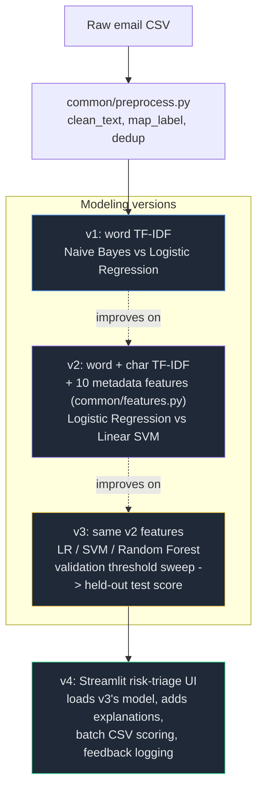

```
     ______________________________________
    |\                                    /|
    | \                                  / |
    |  \________________________________/  |
    |  |                                |  |
    |  |   EMAIL SPAM RISK TRIAGE       |  |
    |  |   ----------------------       |  |
    |  |   v1 -> v2 -> v3 -> v4         |  |
    |  |________________________________|  |
    |______________________________________|
```

[](https://git.io/typing-svg)


An intern learning project: an email spam classifier built as four progressively deeper versions, each with its own design spec. Every version is real, trained, tested, and reproducible - not a mockup.

## Results at a glance

| Version | Focus | Best model | Test F1 | Test accuracy |
|---|---|---|---|---|
| v1 | Basic TF-IDF + Naive Bayes / Logistic Regression | naive_bayes | 0.9813 | 0.9818 |
| v2 | Word+char TF-IDF + 10 engineered metadata features | linear_svm | 0.9894 | 0.9895 |
| v3 | 3-way model comparison, tuned decision threshold, error export | linear_svm @ threshold 0.60 | 0.9891 | 0.9893 |
| v4 | Streamlit risk-triage UI on top of the v3 model | (uses v3's model) | n/a | n/a |

All four run on the same base dataset (`bayes2003/emails-for-spam-or-ham-classification-enron-2006`, 28,063 emails, 80/20 or 70/15/15 stratified split, `random_state=42`). v3's number is the more trustworthy one: its model and threshold were chosen on a validation split, then scored once on a held-out test split that was never touched during tuning.

A one-off stress test against a harder, more heterogeneous 82k-email combined corpus (Enron + CEAS + Nazario + SpamAssassin + Nigerian Fraud + Ling-Spam) is in `experiments/hard_dataset_eval/` - the same v1 approach held up there too (F1 0.9864).

## Pipeline shape



## Setup

```bash
poetry install --no-root
cp .env.example .env   # fill in KAGGLE_USERNAME and KAGGLE_KEY (kaggle.com/settings -> API)
```

## Running each version

```bash
poetry run python -m v1_basic_pipeline.main           # downloads the dataset, trains, evaluates, saves the v1 model
poetry run python -m v2_feature_engineering.main       # trains/evaluates/saves the v2 feature-engineered model
poetry run python -m v3_model_comparison_tuning.main   # compares models, tunes threshold, exports errors
poetry run streamlit run app/streamlit_app.py          # launches the v4 triage UI (needs v3's model already trained)
```

Run the test suite anytime with:

```bash
poetry run pytest -v
```

## Repo layout

- `common/` - code shared across all versions (config, data loading, cleaning, feature extraction)
- `v1_basic_pipeline/` - the v1 baseline pipeline
- `v2_feature_engineering/` - the v2 word+char TF-IDF and metadata-feature pipeline
- `v3_model_comparison_tuning/` - the v3 model comparison, threshold-tuning, and error-analysis pipeline
- `v4_streamlit_app/` and `app/streamlit_app.py` - the v4 app helpers and Streamlit UI
- `experiments/` - one-off experiments not part of the versioned pipeline (e.g. the harder-dataset stress test)
- `data/` - gitignored raw/processed/feedback data
- `tests/` - pytest unit tests, organized per version
