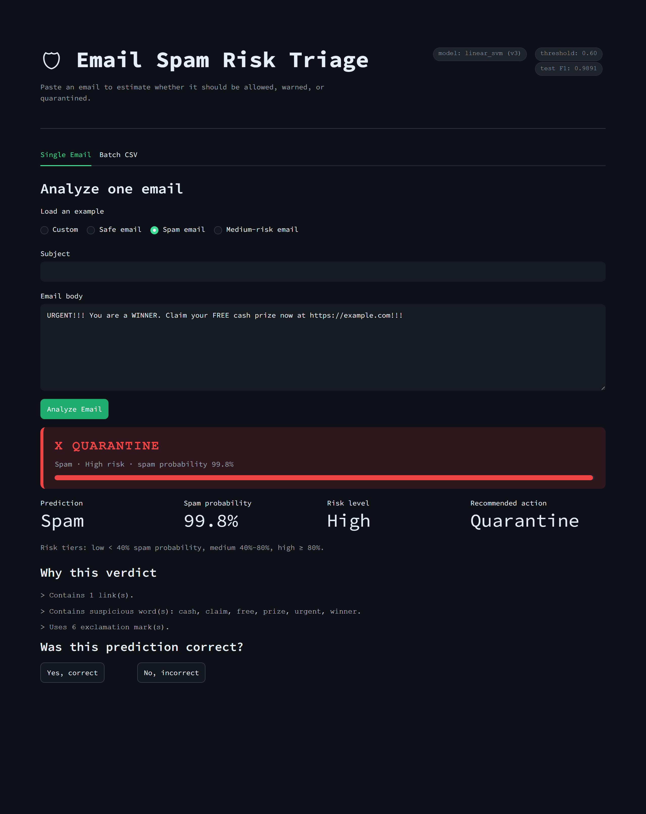

```
  ____  ____   _    __  __   _____ ____  ___    _    ____ _____
 / ___||  _ \ / \  |  \/  | |_   _|  _ \|_ _|  / \  / ___| ____|
 \___ \| |_) / _ \ | |\/| |   | | | |_) || |  / _ \| |  _|  _|
  ___) |  __/ ___ \| |  | |   | | |  _ < | | / ___ \ |_| | |___
 |____/|_| /_/   \_\_|  |_|   |_| |_| \_\___/_/   \_\____|_____|
```

[](https://git.io/typing-svg)


An email spam classifier built as four progressively deeper versions. Every version is real, trained, tested, and reproducible - not a mockup.

## Results at a glance

| Version | Focus | Best model | Test F1 | Test accuracy |
|---|---|---|---|---|
| v1 | Basic TF-IDF + Naive Bayes / Logistic Regression | naive_bayes | 0.9813 | 0.9818 |
| v2 | Word+char TF-IDF + 10 engineered metadata features | linear_svm | 0.9894 | 0.9895 |
| v3 | 3-way model comparison, tuned decision threshold, error export | linear_svm @ threshold 0.60 | 0.9891 | 0.9893 |
| v4 | Streamlit risk-triage UI on top of the v3 model | (uses v3's model) | n/a | n/a |

All four run on the same base dataset (`bayes2003/emails-for-spam-or-ham-classification-enron-2006`, 28,063 emails, 80/20 or 70/15/15 stratified split, `random_state=42`).

### Analysis: v1 vs v2 vs v3

**v1 -> v2 is a real improvement.** Recall jumped from 0.9702 to 0.9949 (only 14 spam emails slipped through in v2, versus 82 in v1) while precision stayed essentially flat. Adding character n-grams and 10 metadata features (link counts, suspicious words, uppercase ratio, etc.) gave the model more ways to catch spam that doesn't share exact vocabulary with the training set - the improvement is genuine, not noise.

**v2 -> v3 looks like a regression (0.9894 -> 0.9891) but isn't - it's a stricter measurement, not a worse model.** Three reasons the number moves down:

1. **v2 leaks a little.** v2's model selection scores both candidates directly on the test set, then reports that same score as the result - the test set influenced which model won, so the number is mildly optimistic. v3 selects its model and tunes its threshold using only a separate validation split, then touches the test set exactly once, at the end, for a score that was never used to make any decision.
2. **v3 trains on less data.** v2 uses an 80/20 split (80% for training); v3 uses 70/15/15 (only 70% for training, since another 15% is carved out purely for validation).
3. **v3's test set is smaller** (~4,210 emails vs ~5,610 for v2), so part of the ~0.0003 gap is just sampling noise between two different held-out subsets of the same data.

**Takeaway:** v3's 0.9891 is the number worth trusting if this model were going into production - it's leak-free and validation-tuned, not just picked-and-graded on the same data. v2's 0.9894 is real, but slightly optimistic by construction.

A one-off stress test against a harder, more heterogeneous 82k-email combined corpus (Enron + CEAS + Nazario + SpamAssassin + Nigerian Fraud + Ling-Spam) is in `experiments/hard_dataset_eval/` - the same v1 approach held up there too (F1 0.9864).

## Pipeline shape


## v4: risk-triage UI



## Setup

```bash
poetry install --no-root
cp .env.example .env   # fill in KAGGLE_USERNAME and KAGGLE_KEY (kaggle.com/settings -> API)
```

## Running each version

```bash
poetry run python -m v1_basic_pipeline.main           # downloads the dataset, trains, evaluates, saves the v1 model
poetry run python -m v2_feature_engineering.main       # trains/evaluates/saves the v2 feature-engineered model
poetry run python -m v3_model_comparison_tuning.main   # compares models, tunes threshold, exports errors
poetry run streamlit run app/streamlit_app.py          # launches the v4 triage UI (needs v3's model already trained)
```

Run the test suite anytime with:

```bash
poetry run pytest -v
```

## Repo layout

- `common/` - code shared across all versions (config, data loading, cleaning, feature extraction)
- `v1_basic_pipeline/` - the v1 baseline pipeline
- `v2_feature_engineering/` - the v2 word+char TF-IDF and metadata-feature pipeline
- `v3_model_comparison_tuning/` - the v3 model comparison, threshold-tuning, and error-analysis pipeline
- `v4_streamlit_app/` and `app/streamlit_app.py` - the v4 app helpers and Streamlit UI
- `experiments/` - one-off experiments not part of the versioned pipeline (e.g. the harder-dataset stress test)
- `data/` - gitignored raw/processed/feedback data
- `tests/` - pytest unit tests, organized per version
